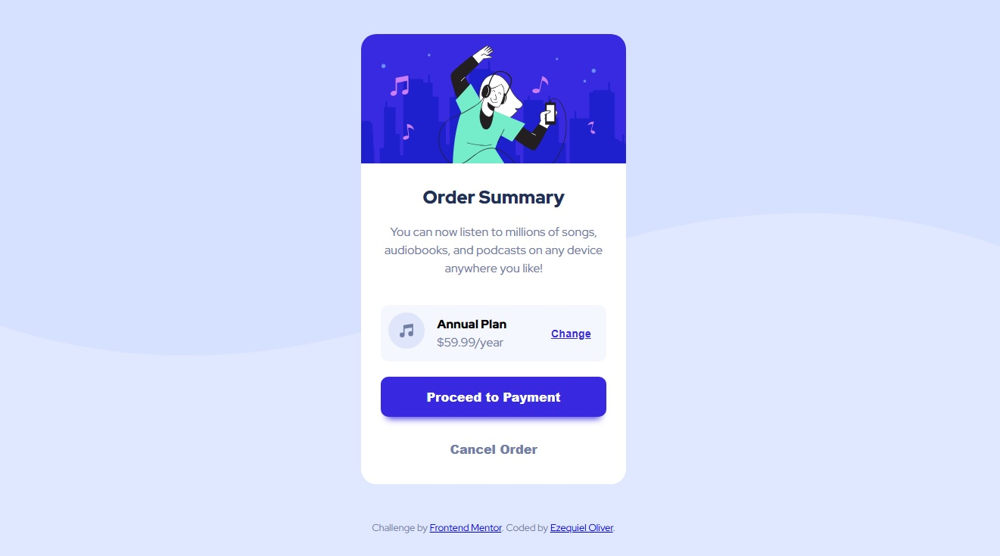

# Frontend Mentor - Order summary card solution
Esta es una solución al [Order summary card challenge on Frontend Mentor](https://www.frontendmentor.io/challenges/order-summary-component-QlPmajDUj). Los desafíos de Frontend Mentor ayudan a mejorar tus habilidades de desarrollo web construyendo proyectos realistas.

## Table of contents

- [Descripción general](#overview)
  - [El desafío](#the-challenge)
  - [Screenshot](#screenshot)
  - [Links](#links)
- [Mi proceso](#my-process)
  - [Tecnologías utilizadas](#built-with)
  - [Lo que aprendí](#what-i-learned)
- [Autor](#author)
- [Agradecimientos](#acknowledgments)


## Descripción General

### El desafío

Los usuarios deben poder:

- Ver los efectos hover en los elementos interactivos.

### Screenshot



### Links

- [Solución](https://www.frontendmentor.io/solutions/responsive-order-summary-card-using-flexbox-NLhJw5fGv_)
- [URL del sitio](https://oliver-92.github.io/Order-Summary-Card/)

## Mi proceso

### Tecnologías utilizadas

- HTML5
- Propiedades personalizadas de CSS
- Flexbox
- Metodología mobile-first

### Lo que aprendí

Durante el desarrollo de este proyecto, reforcé mis conocimientos sobre maquetación con Flexbox y buenas prácticas para el diseño responsivo. También trabajé en mantener una estructura clara del HTML antes de aplicar estilos.

Ejemplo de código que me gustó cómo quedó:


```css
:root {
    --primary-color: hsl(245, 75%, 52%);
    --primary-light: hsl(225, 100%, 94%);
    --neutral-light: hsl(225, 100%, 98%);
    --neutral-dark: hsl(224, 23%, 55%);
    --neutral-darker: hsl(223, 47%, 23%);
}
```

## Autor

- Website - [Ezequiel Oliver](https://oliver-92.github.io/Portafolio/)
- Frontend Mentor - [@Oliver-92](https://www.frontendmentor.io/profile/Oliver-92)

## Agradecimientos

Gracias a la comunidad de Frontend Mentor por el desafío y al autor del diseño original por el excelente layout de práctica.